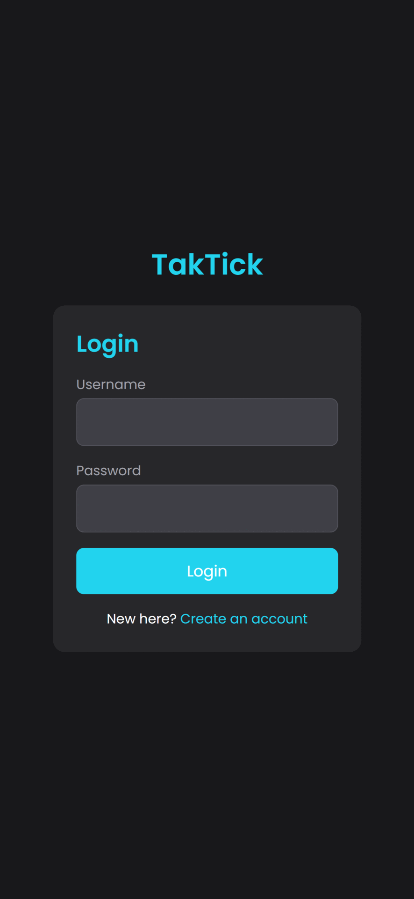

# TakTick - Task Management Application

A modern task management application built with React and Node.js, featuring intuitive task organization.

## Live Demo

Visit [TakTick](https://taktick.netlify.app/) to try the application.

## Preview

<div style="text-align: center;">
  
</div>

## Features

- User authentication and authorization
- Create, edit, and delete tasks
- Task status tracking (Draft, In Progress, On Hold, Completed, Deleted)
- Priority levels management
- Due date tracking
- Task statistics and data visualization
- Mobile-responsive design
- Dark mode interface

## Tech Stack

- **Frontend**: React, Vite, TailwindCSS
- **Backend**: Node.js, Express
- **Database**: MongoDB
- **Hosting**: Netlify (Frontend), Render (Backend)

## Local Development

1. Clone the repository
2. Install dependencies:
```bash
npm install
```

3. Create `.env` files:

Frontend (.env.development):
```
VITE_API_URL=http://localhost:5000/api
```

Backend (.env):
```
MONGODB_URI=your_mongodb_uri
JWT_SECRET=your_jwt_secret
PORT=5000
```

4. Start development servers:
```bash
# Frontend
npm run dev

# Backend
npm run server
```

## Contribute

Feel free to submit issues and pull requests.

## License

MIT License
